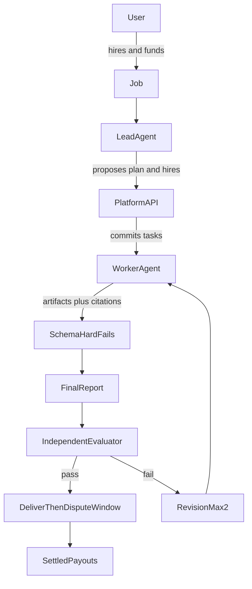
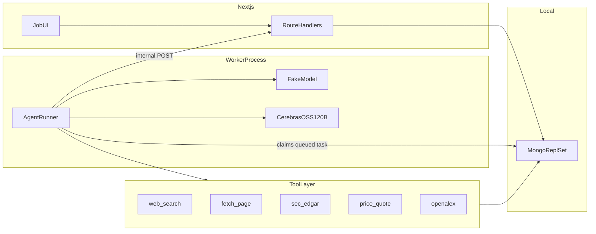
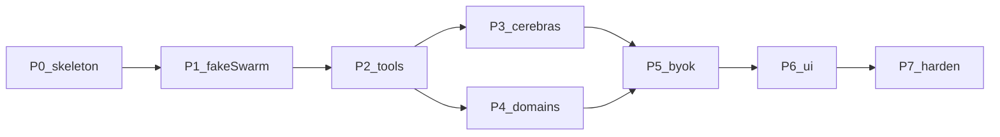

# Research Multiagent Platform — Build Plan

Greenfield repo: `/Users/mrinal/Documents/multiagent` (empty).

v1 is **research only**: agents read sources and write a cited report. No trades, email, posts, or third-party writes.

**How to read this.** Sections 1–24 are the specification and are the only part you implement from. Sections 25–30 are an audit log kept deliberately: each entry says what was wrong and why the current choice is what it is, which is the fastest way to avoid "simplifying" a rule back into a bug. Where a section explains an odd-looking decision, the explanation is load-bearing.

**Known limits accepted for v1**, not oversights: the job owner resolves their own dispute (play money only, must change before real payouts); the brief denylist is five phrases and is trivially bypassable; rate limiting is an in-memory Map and resets on restart; a single worker process handles all jobs.

---

## Review notes (what was wrong)

- **Wallet model was doubled:** `users.walletCents` and a `wallets` collection. **Decision:** one `users` document with `availableCents` + `escrowedCents`. No `wallets` collection.
- **Payouts path was wrong:** text said `packages/domain/payouts.ts`; layout is a single Next app. **Decision:** [`src/domain/payouts.ts`](src/domain/payouts.ts).
- **“Clerk-protected except webhooks”** implied Clerk user webhooks. **Decision:** v1 **lazy-upserts** `users` on first authenticated request. No Clerk webhook in v1.
- **Worker roles were vague** (three kinds vs one). **Decision:** seed **three** listings only: `lead`, `worker`, `evaluator`. Worker does sources + draft. Split hunter/analyst/writer later as more listings, same task types.
- **Eval scope unclear.** **Decision:** schema/hard-fail checks on every submit; **LLM evaluator only on the final report** (and on a failed report retry). Saves cost and matches “not costly APIs.”
- **Max-revision outcome not locked.** **Decision:** after 2 failed final evals → `cancelled`, unused escrow refunded, **partial pay table** below.
- **Play-money source missing.** **Decision:** first user upsert credits **$1000** (`100000` cents) — see section 5 for why $100 was too little. Dev-only `POST /api/wallet/dev-credit` behind `NODE_ENV !== production`.
- **ODM not chosen.** **Decision:** **Mongoose 8** + Mongo replica set (required for multi-doc transactions on fund/settle).
- **Search/prices vendors not locked.** **Decision:** adapters. Default search = **Serper**. Default prices = **Alpha Vantage** (free). Tests never call them.

**Gaps filled in this revision (section 15+)**

- Lead had no task type; “assemble memo” conflicted with worker report
- Listing `priceCents` vs 35/45/12/8 split
- Who the ledger payee is when listings are platform-owned
- Task DAG, revision scope, schema-fail retries
- Worker poll algorithm + delivered→settled cron
- Compute cost formula (cents from tokens + tools)
- Min/max budget, fund idempotency, compute-exhausted
- Tool I/O contracts, event types, JSON API shapes
- Clerk middleware, test auth, GitHub Actions, Node/Next versions
- Exact file tree and seed script

---

## Locked stack

- Auth: **Clerk** (`@clerk/nextjs`)
- DB: **local MongoDB**, database `multiagent`, **replica set** (`rs0`). Standalone `mongod` cannot do transactions.
- ODM: **Mongoose**
- App: **Next.js** App Router. HTTP only via **route handlers** under `src/app/api/` (no server actions for money/state).
- Worker: separate `pnpm worker` process, same repo
- LLM: **Cerebras PAYG `gpt-oss-120b`** via `@ai-sdk/cerebras`. No parallel tool calls. Context 131k paid — tools must extract text, never dump raw HTML. `reasoning_effort`: `low` | `medium` | `high` (default `low`; `none` is a 400).
- Out of scope: Kimi K2.6 (dedicated only), Eve, Fidence, Groq in CI, LLM BYOK
- Tests: Vitest + Playwright + `mongodb-memory-server` **replset**
- Files: **none on disk** — artifacts and snapshots live in Mongo; downloads are generated on demand (see section 19)
- Package manager: **pnpm**
- Money: integer **USD cents**
- Language: TypeScript strict
- Runtime: **Node 20**, **Next.js 15**, React 19
- Logging: `console` with a `redact()` helper (no Pino in v1)

---

## 1. Product

User funds a research job, a **lead** listing proposes a plan, user approves, platform assigns the **worker** and **evaluator**, worker submits sourced artifacts, evaluator scores the **final report**, escrow splits only after pass — or partial pay + refund on cancel/exhaust.



**Lead proposes; platform commits.** Models cannot create tasks, move escrow, or insert ledger rows except by returning JSON that the API validates.

**Seed listings** (`ownerUserId: "platform"`)

| slug | kind | priceCents | does |
|---|---|---|---|
| `lead-research` | lead | 3500 | one `plan` task only — no second “assemble” run |
| `worker-research` | worker | 4500 | `scope` → `sources` → `findings` → `report` |
| `eval-research` | evaluator | 1200 | scores the **worker `report`**; that report is the user-facing memo |

`priceCents` is **catalog display only**. Settlement is always a **percent of escrow**, not these list prices. Approve-plan checks `estimatedCostCents <= budgetCents`. If the lead omits an estimate, platform sets it to `budgetCents`.

**v1 journeys**

1. Clerk sign-in → upsert user + $1000 play-money faucet if new
2. Create job: brief, `domain`, `budgetCents`
3. Fund → escrow lock (`available` → `escrowed`)
4. Lead runs (fake or Cerebras) → `plan_review`
5. User approves plan + cost
6. Worker runs **`scope` → `sources` → `findings` → `report`** (next task is queued only after the previous `passed_schema`)
7. Schema checks each submit; evaluator runs **only** on `report` (that markdown is what the user downloads)
8. Pass → `delivered` → 24h dispute window → `settled`
9. Optional BYOK for search / prices

**v1 non-goals**

- Action tools
- Third-party webhooks / public marketplace
- Fidence, Eve, Slack, Kimi, Groq-in-CI, LLM BYOK
- `news` pack (enum exists; plans that request it are rejected)

---

## 2. Architecture



**Two API layers**

1. Reasoning: fake in CI, Cerebras in live
2. Evidence: allowlist from `job.domain`. Secrets stay in the tool executor

**Task claim (avoid double-run):** worker does `findOneAndUpdate({ status: "queued" }, { status: "running", lockedAt, lockedBy }, { sort: { createdAt: 1 } })`. The sort matters: without it Mongo returns an arbitrary match and the DAG order in section 15 is not actually enforced. Stale lock (> 10 min) is reaped back to `queued`.

**Timeouts (canonical — do not restate elsewhere):** `plan` 2 min fake / 3 min live; `scope` `sources` `findings` `report` 5 / 8 min; `evaluate` 3 / 5 min. Written to `tasks.timeoutMs` when the task is created, so a running task carries its own deadline and the worker never consults this table at claim time.

**One retry counter.** `task.attempt` starts at 1 and increments on **either** a `timed_out` run or a `schema_failed` submit. `attempt > 2` is terminal for that task: `plan` → job `cancelled` (full refund); `scope|sources|findings` → job `cancelled` (partial table); `report` → counts as one eval-fail toward `revisionsUsed`; `evaluate` → job `cancelled` (evaluator unpaid). Lock reaping does **not** increment `attempt` (a crashed process is not the agent's fault); it only returns the task to `queued`.

Polling interval: 1s local. No Temporal/Inngest in v1.

---

## 3. State machine

Only [`src/domain/job-machine.ts`](src/domain/job-machine.ts) may change `job.status`.

| From | Event | To |
|---|---|---|
| `draft` | fund (balance ≥ budget) | `funded` then immediately `planning` (same transaction; `plan` task queued) |
| `planning` | lead artifact valid | `plan_review` |
| `planning` | lead fail/timeout | `cancelled` (full refund) |
| `plan_review` | user approve and cost ≤ budget | `staffing` |
| `plan_review` | user stop | `cancelled` (full refund) |
| `staffing` | assignments written | `in_progress` |
| `in_progress` | report submitted and schema ok | `evaluating` |
| `evaluating` | eval pass | `delivered` |
| `evaluating` | eval fail and `revisionsUsed < caps.maxRevisions` | `revision`, then `revisionsUsed++` |
| `evaluating` | eval fail and `revisionsUsed === caps.maxRevisions` | `cancelled` |
| `revision` | worker re-queued | `in_progress` |
| `delivered` | user reject inside the dispute window | `disputed` |
| `delivered` | `disputeHours` elapsed or user accept | `settled` |
| `disputed` | admin/dev resolve (v1: refund unused + keep eval pay) | `cancelled` or `settled` |
| `funded` `planning` `plan_review` `staffing` `in_progress` `evaluating` `revision` | `POST /stop` | `cancelled` (partial table) |

Illegal jumps (`draft` → `delivered`) throw and are tested (`P0-API-02`).

**"Almost any active" was not a specification.** The stop row used to say that, which leaves an implementer guessing at exactly the boundary where money moves. The list above is exhaustive. `draft` is not stoppable (nothing is escrowed — delete it instead); `delivered` is not stoppable (use `/accept` or `/dispute`, since the work is done and the dispute window exists for precisely this); `disputed`, `settled`, and `cancelled` are terminal or owned by `/resolve-dispute`. Stop from any other state is a `conflict` 409. `funded`, `staffing`, and `revision` appear in the list only for completeness — per the note below they are transactional and a user request should never catch a job inside one, but accepting a stop there is safer than throwing.

**Three states are transient and have no actor.** `funded`, `staffing`, and `revision` are each written and then immediately left **inside the same transaction** as the request that caused them — fund, approve-plan, and the eval-fail handler respectively. No worker ever observes a job sitting in one, which is why section 15's claim filter lists only `planning | in_progress | evaluating`. They exist so the event log shows the step; if you find a job parked in one, a transaction aborted midway and it is a bug.

**Task types:** `plan` (lead) | `scope` | `sources` | `findings` | `report` (worker) | `evaluate` (evaluator).

**Task status:** `created → queued → running → submitted → schema_failed | passed_schema` then, for `evaluate` only, `passed | failed`. Any running task may become `timed_out`.

**On fund:** create one `plan` task (`queued`, listing `lead-research`), set job `planning` (do not wait for a mysterious “worker picks lead”).

**On approve-plan:** create worker tasks in DAG order (only `scope` starts `queued`; others `created`); create one `evaluate` task `created` (queued when report `passed_schema`). Always force slugs `worker-research` + `eval-research` if the lead omitted them.

**Revision:** increment `revisionsUsed`, requeue **only** `report` (keep scope/sources/findings artifacts). Reset evaluate task to `queued` after the new report passes schema.

**Revision arithmetic (off-by-one trap).** With `maxRevisions: 2` the job gets **three** evaluations, not two: fail 1 → `revisionsUsed = 1`, fail 2 → `revisionsUsed = 2`, fail 3 → `cancelled`. Name tests accordingly.

**`attempt` resets to 1 on a revision requeue; `round` does not.** The two counters measure different things and nothing previously said how they interact. `attempt` counts failures *within* one assignment of a task (timeouts and schema failures, terminal above 2); `round` counts revisions of the report across the job. If `attempt` carried over, a report that hit one schema failure in round 0 would enter round 1 already one strike from terminal and could cancel the whole job on a single hiccup — a revision is a fresh assignment, so it gets a fresh budget of attempts.

**schema_failed:** requeue same task, `attempt++`, per the single retry counter in section 2.

**`plan_review` expiry:** a job idle in `plan_review` for **7 days** is auto-cancelled with a 100% refund on the worker tick. Escrow is never held indefinitely.

**compute exhausted:** `computeSpentCents >= computeBudgetCents` → job `cancelled` reason `compute_exhausted`, partial pay table.

**delivered → settled:** worker tick every 30s: if `deliveredAt + job.evalPolicy.disputeHours <= now` (read from the job, not a constant) and status is still `delivered`, `settle()`. `POST /accept` settles immediately.

**Dispute in v1 is deliberately toothless:** there is no admin. `POST /dispute` moves `delivered → disputed`, which only **stops the auto-settle clock**. `POST /resolve-dispute { outcome }` lets the owner finish it. Since the owner can choose `cancelled`, v1 effectively allows self-refund — acceptable with play money, and it must be replaced before real payouts. Noted as a known limitation, not a bug.

---

## 4. Mongo collections

Database: `multiagent`. All money fields are `number` cents. All ids are `ObjectId` except `clerkUserId` (string) and `ownerUserId` (`"platform"` or user ObjectId hex).

**`users`**

```text
clerkUserId       unique
email
displayName
availableCents
escrowedCents
createdAt updatedAt
```

**`agent_listings`** — seed three rows as above. Fields: `slug` unique, `kind`, `ownerUserId`, `vertical: "research"`, `priceCents`, `runtime: "hosted_prompt"`, `status: "live"|"paused"`.

**`jobs`**

```text
userId            ObjectId
clerkUserId
domain            general|finance|academic|news
brief
status
budgetCents              payout cap
computeBudgetCents       token+search meter (default 500 = $5)
computeSpentCents
escrowCents
planId
evalPolicy        { independentRequired: true, minEvaluators: 1, disputeHours: 24 }
caps              { maxSearches: 8, maxFetches: 12, maxDomainCalls: 20, maxRevisions: 2, maxHireDepth: 1 }
revisionsUsed
useUserSearch     boolean
useUserPrices     boolean
fallbackToPlatform boolean   default false
planSubmittedAt   set when the job enters plan_review; drives the 7-day expiry
deliveredAt
cancelReason      user_stop|lead_failed|revisions_exhausted|compute_exhausted|plan_expired|task_failed
createdAt updatedAt
```

`planSubmittedAt` exists because the expiry sweep must not key off `updatedAt`: any unrelated write (an event append, a compute-spend bump) would silently reset a job's 7-day clock.

**`job_plans`** — `{ jobId, tasks[], proposedListingSlugs[], estimatedCostCents, questions[], approvedAt? }`. Immutable after `approvedAt`.

**`tasks`** — `{ jobId, type: plan|scope|sources|findings|report|evaluate, status, listingId, attempt, lockedAt, lockedBy, timeoutMs, createdAt }`.

`createdAt` is load-bearing, not bookkeeping: the claimer sorts on it to get DAG order. Enable Mongoose `timestamps` on every model so `createdAt`/`updatedAt` exist everywhere, and let the ones named in the index list be relied on.

**`assignments`** — `{ taskId, jobId, listingId, ownerUserId, role }`. Purpose: receipt attribution + the self-eval rule. Payout percentages do **not** read this collection.

**Self-eval rule (corrected):** reject an evaluator assignment when its `ownerUserId` equals a worker `ownerUserId` on the same job **and that owner is not `"platform"`**. All three v1 seed listings are platform-owned, so without this exemption every job would be blocked. Implement as `isIndependent(evaluatorOwner, workerOwners)` in [`src/domain/allowlists.ts`](src/domain/allowlists.ts): `owner === "platform" ? true : !workerOwners.includes(owner)`.

**`artifacts`** — `{ taskId, jobId, round, attempt, markdown, payload, citations[], createdAt }`.

Citation: `{ snapshotId, url, quote, sourceClass: web|filing|price|paper, doi?, arxivId?, accession? }`.

`doi` and `arxivId` are not decorative: the `missing_paper_id` hard fail checks them, and without them on the type that check could never fire. `paper_search` / `paper_get` populate them; `sec_*` populates `accession`. **Only tools that write a snapshot can be cited** — `web_search` returns hits with no `snapshotId`, so a search result is a lead to follow with `fetch_page`, never a citation on its own.

The `plan` task writes **`job_plans`**, not `artifacts`. Every other task type writes one artifact per attempt.

**Revision needs a round discriminator.** A revision requeues the *same* `report` task, so after one revision the job holds two report artifacts with the same `taskId` — and nothing in the earlier schema said which one is the deliverable. `round` is `job.revisionsUsed` at write time. Every reader takes the highest `round`, then the highest `attempt`: the download route's `memo.md`, the hard-fail checks, and the evaluator prompt. Index `artifacts.taskId+round+attempt`.

**`source_snapshots`** — `{ jobId, url, retrievedAt, text, sha256, toolName }`. Unique `(jobId, url)`.

**`evaluations`** — `{ jobId, taskId, reportTaskId, round, evaluatorListingId, scores: Scores | null, pass, hardFails[], comments, createdAt }`. `taskId` is the `evaluate` task; `reportTaskId` is the `report` task being graded; `round` matches the artifact round. `scores` is `null` exactly when a deterministic hard fail short-circuited the model — the row still records `pass: false` and the `hardFails` that caused it, so the timeline can explain the failure without scores.

Both task ids repeat across revisions (the same two task documents are reused), so `round` is the only thing separating the second evaluation from the first. Unique `(jobId, round)`. The evaluate task also re-enters `queued` from a terminal `passed`/`failed` status on revision — that is the one legal backwards move in the task status graph, and it is made by the revision handler, not the worker.

**`ledger_entries`** — `{ jobId, payeeUserId: "platform" | userObjectIdHex, role: lead|worker|evaluator|platform_fee|user_refund, listingId?, cents, idempotencyKey unique }`.

v1 seed listings are platform-owned, so lead/worker/evaluator lines also use `payeeUserId: "platform"`. Marketplace later sets `payeeUserId` from `listing.ownerUserId`. `platform_fee` is always `"platform"`.

**No `payouts` collection.** An earlier draft had one, unique on `(jobId, payeeUserId, role)` — which is exactly the `settle:${jobId}:${payeeUserId}:${role}` idempotency key already enforced on `ledger_entries`. Two collections recording one settlement is the same duplication the first audit removed for `wallets`. Receipts are built from `ledger_entries` alone.

**`tool_invocations`** — `{ jobId, taskId, tool, argsHash, resultHash, tokens, costCents, credentialSource: platform|user|fallback }`.

**`user_credentials`** — `{ userId, kind: web_search|prices, iv, tag, ciphertext, last4, createdAt }`. Unique `(userId, kind)`. APIs return `{ configured: true, last4 }` only.

Two corrections here. The schema previously held only `ciphertext` while section 18 specifies AES-256-GCM and stores `{ iv, tag, ciphertext }` — decryption is impossible without the IV and the auth tag, so they are columns, not an afterthought. And without unique `(userId, kind)` a second `PUT /api/credentials` inserts a *second* row rather than replacing the first, leaving two keys for one slot and no defined winner; `PUT` is an upsert on that pair.

**`events`** — `{ jobId, type, payload, at }` append-only.

**Indexes:** `users.clerkUserId` unique; `jobs.userId+status`; `jobs.status+deliveredAt` (settle sweep); `jobs.status+planSubmittedAt` (plan_review expiry); `tasks.jobId+type`; `tasks.status+createdAt` (claimer sort); `tasks.status+lockedAt` (reaper); `artifacts.taskId+round+attempt`; `evaluations.jobId+round` unique; `events.jobId+at` (timeline); `tool_invocations.jobId`; `ledger_entries.idempotencyKey` unique; `source_snapshots.jobId+url` unique; `assignments.jobId+role`.

**No separate `wallets` collection.**

---

## 5. Money

**Faucet:** new user `availableCents = 100000` ($1000).

The earlier $100 faucet was a dead end: budget max is $100, and a **successful** job refunds nothing, so one completed job left the user at $0 and unable to create another (min budget $20). Multi-job e2e suites would fail on the second job. Three fixes together:

- Faucet is **$1000**, good for roughly 10 max-budget jobs
- `POST /api/wallet/dev-credit` is allowed when `NODE_ENV !== "production"`, so tests can top up
- The jobs page shows a "add play money" button in non-production builds

**Budget bounds on create:** `budgetCents` in `[2000, 10000]` ($20–$100). `computeBudgetCents` default `500` (overridable, max 2000); tests may seed `1` directly in Mongo for `P3-CAP-01` (the API enforces a floor of 50).

**Fund:** transaction: if `availableCents >= budgetCents`, decrement available, increment escrowed, set `jobs.escrowCents = budgetCents`, create `plan` task, status `planning`. Second fund on same job → 409. Concurrent double-fund: unique partial index or status check inside the txn (`status: draft` only).

**Two payout paths, not one.** [`src/domain/payouts.ts`](src/domain/payouts.ts) exports `settleFull()` (job passed evaluation) and `settlePartial()` (any cancel). Both end with the same fee and refund lines. Earlier drafts implied one universal formula, which silently contradicted the success row of the table below.

```text
settleFull(escrow):                       // job passed evaluation
  leadCents   = floor(0.35 * escrow)
  workerCents = floor(0.45 * escrow)
  evalCents   = floor(0.12 * escrow)
  feeCents    = escrow - leadCents - workerCents - evalCents   // absorbs the dust
  refundCents = 0                                              // exact by construction

settlePartial(escrow):                    // any cancel
  leadCents   = planApproved  ? floor(0.10 * escrow) : 0
  workerCents = floor(0.1125 * escrow) * (# worker tasks passed_schema)   // 45% / 4
  evalCents   = evalSubmitted ? floor(0.12 * escrow) : 0
  feeCents    = floor((leadCents + workerCents + evalCents) * 8 / 92)
  refundCents = escrow - leadCents - workerCents - evalCents - feeCents   // absorbs the dust
```

**Who absorbs the rounding dust differs by path, and that is deliberate.** Three `floor` calls cannot hit the escrow exactly: at escrow 9999 the nominal shares are 3499.65 / 4499.55 / 1199.88, and flooring loses 3 cents. On **success** the platform fee takes the remainder so the refund is exactly 0, matching the "settled" row of the table. On **cancel** the refund takes the remainder so a stray cent favours the user. Either way the five lines sum to `escrowCents` by construction rather than by luck.

An earlier revision computed `feeCents = floor(agentPay * 8 / 92)` on *both* paths. That is right for cancel but wrong for success: at escrow 9999 it yields a fee of 799 and a refund of 3 on a job that delivered, contradicting the table — and `P1-LEDGER-03` as originally written asserted `refundCents === 0` and would have failed at 2001 and 9999. The `8/92` ratio survives only in `settlePartial()`, where it is still needed because agent pay there is 92 parts of the released total, so the fee is `8/92` of it, not `0.08` of it.

| Situation | Lead | Worker | Evaluator | Platform fee | Refund |
|---|---|---|---|---|---|
| Cancel before plan submitted | 0 | 0 | 0 | 0 | 100% |
| Cancel at `plan_review` | 0 | 0 | 0 | 0 | 100% |
| Cancel mid-work | 10% | 11.25% per passed task | 12% if a review ran | 8/92 of agent pay | remainder + dust |
| Revisions exhausted | 10% | 11.25% per passed task | 12% | 8/92 of agent pay | remainder + dust |
| `compute_exhausted` | same as mid-work | | | | |
| `settled` after pass | 35% | 45% | 12% | 8% + dust | 0 |

`refundCents` is never negative: assert in [`src/domain/payouts.ts`](src/domain/payouts.ts) and test it (`P1-LEDGER-02`).

**Wallet effect of settle/cancel** (this was missing and the math breaks without it):

```text
user.escrowedCents -= escrowCents          // always release the whole lock
user.availableCents += refundCents         // only the refund comes back
```

Agent-role and `platform_fee` lines are **ledger rows only**. v1 has no platform user balance; money paid out simply leaves the user wallet. `P1-E2E-01` asserts `lead + worker + eval + fee + refund === escrowCents` and that the user's `escrowedCents` returns to 0.

Compute spend is **not** taken from listing payouts. It is a platform cost in v1. Kill the job if `computeSpentCents >= computeBudgetCents`.

**Cost formula** (integer cents, always `Math.ceil`):

Charged **per event, as a delta** — never recomputed from running totals, or every model call would re-bill every tool call made so far:

```text
// once per model response, from that response's usage
tokenCents = ceil((inputTokens * 35 + outputTokens * 75) / 1_000_000)
  // Cerebras $0.35 / $0.75 per 1M

// once per individual tool call
toolCents  = (tool === "web_search" || tool === "fetch_page") ? 1 : 2

computeSpentCents += tokenCents            // $inc, at each model response
computeSpentCents += toolCents             // $inc, at each tool call
```

Both are `$inc` on the job document so concurrent writes cannot clobber each other. `tool_invocations.costCents` stores the same delta, so the sum of that column reconciles against `computeSpentCents`.

Fake provider: `tokenCents = 0`, still charge `toolCents` so cap tests work.

Idempotency: `settle:${jobId}:${payeeUserId}:${role}`. Double settle is a no-op (`P0-API-04`), enforced by the unique index, inside the same transaction as the wallet update.

---

## 6. Domains and tools

| Domain | Tools |
|---|---|
| `general` | `web_search`, `fetch_page` |
| `finance` | + `sec_search`, `sec_filing`, `price_quote` |
| `academic` | + `paper_search`, `paper_get` |
| `news` | none; create or plan using `news` → 400 |

**Adapters** (swap vendor without changing agents):

- `src/tools/search/{serper,fake}.ts`
- `src/tools/prices/{alphavantage,fake}.ts`
- `src/tools/sec/{edgar,fake}.ts`
- `src/tools/papers/{openalex,fake}.ts`

`fetch_page` rules live in **section 16 only** (single source of truth). Do not duplicate the SSRF list here.

Citations **must** include `snapshotId` that exists on that job. Hard-fail otherwise.

**Key resolution:** job flags → `user_credentials` → `process.env`. Two distinct failures, both landing in the same place:

- **Vendor rejects the user key (401/403)** — `fallbackToPlatform === false` → `credential_error`, no silent spend on the platform key
- **The row is gone** — the user deleted their key after the job started, while `useUserSearch` is still true on the job. Same treatment: `credential_error` unless `fallbackToPlatform`. A job does not silently change who pays partway through

Only the second was undefined before, and it is the more likely one: `DELETE /api/credentials` is reachable at any time, including mid-job.

Cerebras workers call tools **sequentially** (`parallel_tool_calls` unsupported on `gpt-oss-120b`).

---

## 7. Agent runtime

`runAgent({ listing, task, provider: "fake" | "cerebras" })` in [`src/agent/run-agent.ts`](src/agent/run-agent.ts).

**Fake:** map `kind + task.type` → [`e2e/fixtures/models/*.json`](e2e/fixtures/models/).

**Cerebras:** model `gpt-oss-120b`, Zod `.strict()`, retry **once** on parse fail, then task `failed`.

**The two retry layers are nested, and the product is the cost ceiling.** The Zod reparse is an inner retry (2 model calls) and `task.attempt` is an outer one (3 tries, per section 2), so a pathological task can make **6** model calls before it gives up. That is bounded but not free, and it is the reason `computeBudgetCents` is checked before every model call rather than once per task — the cap, not the retry count, is what actually stops runaway spend.

**Schemas**

- Lead: `{ tasks: { type, acceptance }[], proposedListingSlugs: string[], estimatedCostCents: number, questions: string[] }`
- Worker `scope`: `{ questions: string[], inclusions: string[], exclusions: string[], acceptance: string[] }` (citations optional)
- Worker sources/findings: `{ notes: string, citations: Citation[] }` — `sources` requires **≥ 5** distinct snapshots, matching the `too_few_sources` hard fail so a task cannot pass schema and then fail the report for the same reason
- Worker report: `{ markdown: string, citationIds: string[] }` — **`citationIds` are `source_snapshots._id` values**, not ids of `Citation` objects. The two were easy to confuse because `Citation` carries a `snapshotId` field; the report references snapshots directly, and `citation_without_snapshot` checks exactly that set. Every entry must exist on this job, and there must be **≥ 5 distinct** ones (see `too_few_sources`)
- Evaluator: `{ scores: { brief_coverage, citation_quality, accuracy_tells, structure, uncertainty }, pass, hardFails, comments }` — all score keys required, each 0–100. This is the **model-output** Zod schema. The stored `evaluations.scores` is nullable, because a deterministic hard fail skips the model and there are no scores to store

**Final-report rubric** (weights sum 100)

- brief_coverage 25
- citation_quality 25
- accuracy_tells 25
- structure 15
- uncertainty 10

**Two functions, two moments.** [`src/domain/hard-fails.ts`](src/domain/hard-fails.ts) exports `computeHardFails(report, job)`, which runs **before** the evaluator model, and `computeVerdict(scores, hardFails)`, which runs **after** it:

```ts
const hardFails = computeHardFails(report, job);
if (hardFails.length > 0) return { pass: false, scores: null, hardFails };  // skip the model
const scores = await runEvaluatorModel(report);
return computeVerdict(scores, hardFails);   // pass = weighted >= 75 && no hard fails
```

**A deterministic hard fail short-circuits the model entirely.** There is no point paying for tokens to grade a report that already cites a snapshot which does not exist — the verdict cannot change. This is why `P2-EVAL-01` and `P4-FIN-04` need no model at all and run in CI on the fake provider.

**The platform decides pass, not the model.** The evaluator's own `pass` field is recorded for debugging and otherwise ignored; otherwise a model returning `{ pass: true }` alongside failing scores creates an undefined outcome and the rubric weights become decorative.

**Hard fails are computed in code, not by the model** (otherwise they are untestable and gameable). `computeHardFails` checks:

- `citation_without_snapshot` — any `citationId` not in this job's `source_snapshots`
- `quote_not_in_snapshot` — citation `quote` not a substring of the snapshot text (normalized whitespace)
- `unsourced_figure` — regex for money/percent/market-cap tokens in report markdown whose nearest citation is `sourceClass: "web"` while `domain === "finance"`
- `missing_paper_id` — `domain === "academic"` and a citation lacks `doi` and `arxivId`
- `too_few_sources` — fewer than 5 distinct snapshots cited in the report

The model's own `hardFails` entries are advisory and appended. A deterministic hard fail forces `pass: false` regardless of scores.

Injection: tool body is wrapped as `SOURCE_DOCUMENT` data, not instructions. Fixture `e2e/fixtures/apis/inject-pass.html` used in `P7-INJ-01`.

---

## 8. HTTP API

All of these require Clerk except `GET /api/health`. **No webhooks in v1.**

| Method | Path | Who |
|---|---|---|
| GET | `/api/health` | public |
| GET | `/api/me` | upsert user + faucet |
| GET | `/api/listings` | auth |
| GET | `/api/jobs` | owner list |
| POST | `/api/jobs` | `{ brief, domain, budgetCents }` |
| GET | `/api/jobs/:id` | owner; timeline, artifacts, receipt |
| GET | `/api/jobs/:id/download` | owner; `?file=memo.md\|sources.json\|receipt.json` |
| POST | `/api/jobs/:id/fund` | owner |
| POST | `/api/jobs/:id/approve-plan` | owner |
| POST | `/api/jobs/:id/stop` | owner |
| POST | `/api/jobs/:id/accept` | owner; skip wait → settle |
| POST | `/api/jobs/:id/dispute` | owner; only within `evalPolicy.disputeHours` of deliver |
| POST | `/api/jobs/:id/resolve-dispute` | owner; `{ outcome: cancelled \| settled }` |
| GET/PUT/DELETE | `/api/credentials` | owner BYOK (`DELETE ?kind=web_search`) |
| POST | `/api/wallet/dev-credit` | non-production |
| POST | `/api/internal/tasks/:id/submit` | worker process (shared `WORKER_SECRET`) |
| POST | `/api/internal/tasks/:id/evaluate` | worker |
| POST | `/api/internal/jobs/:id/plan` | worker |

Internal routes are **not** Clerk; they check `Authorization: Bearer WORKER_SECRET`. UI never calls them.

Lead JSON that exceeds `budgetCents` or uses a slug not in listings or a tool not in the domain pack → stay in `plan_review` with error event; user can stop or (v1) we re-queue lead once.

---

## 9. UI

- `/sign-in` `/sign-up` (Clerk)
- `/` jobs + available/escrowed balance
- `/jobs/new` brief, domain, budget, tool-pack preview, BYOK badges
- `/jobs/[id]` machine status, events, plan approve, artifacts, eval, downloads (`memo.md`, `sources.json`, `receipt.json`)
- `/settings` BYOK (show `last4` only)
- Empty, error, timeout copy
- Mobile: approve + stop reachable

No Slack, no publisher console.

---

## 10. Repo layout

```text
src/app/                 # pages + api route handlers
src/domain/              # job-machine.ts, payouts.ts, allowlists.ts, denylist.ts
src/db/                  # mongoose connect, models/, indexes
src/agent/               # run-agent.ts, fake.ts, cerebras.ts, schemas.ts
src/tools/               # search, fetch, sec, prices, papers + ssrf
src/crypto/              # AES-256-GCM for BYOK
src/worker/              # poll + claim loop
e2e/api e2e/ui e2e/agent e2e/fixtures e2e/live
docker-compose.yml       # mongo:7 replica set if local mongod is standalone
```

Section 19 is the authoritative tree; this is the summary.

Scripts: `pnpm dev`, `pnpm worker`, `pnpm test`, `pnpm test:e2e`, `pnpm test:e2e:ui`, `pnpm test:live`.

README **must** document: local Mongo must be a replica set; example `mongod --replSet rs0` + `rs.initiate()`, or `docker compose up`.

---

## 11. Brief denylist (create-job)

Reject (400) if brief matches (case-insensitive) medical-diagnosis, write-a-prescription, insider-trading, buy/sell-this-stock-now, draft-court-filing-as-counsel. Research *about* public markets or public health policy is allowed; “tell me what to trade / diagnose me” is not.

---

## 12. Phases and e2e

CI: `AGENT_PROVIDER=fake`, mocked tool HTTP, memory Mongo replset, **no paid APIs**.

### Phase 0 — Skeleton

Clerk + Mongoose + faucet + job CRUD + fund/cancel. No LLM.

- `P0-API-01` me → $1000; create; fund; escrow locked; available dropped
- `P0-API-02` no status-mutating route exists; `jobMachine.transition("draft" → "delivered")` throws
- `P0-API-03` stop funded → 100% refund, `escrowedCents` back to `availableCents`
- `P0-API-04` `settle()` called twice on a seeded delivered job → one ledger set (unit-level; full settle path lands in P1)
- `P0-API-05` budget out of `[2000, 10000]` → 400
- `P0-API-06` double fund → 409
- `P0-API-07` two sequential jobs from one faucet both fund successfully
- `P0-API-08` denylisted brief → 400 `denylist`; a brief researching the same topic legitimately ("how insider trading rules evolved") is accepted
- `P0-API-09` two concurrent first requests for one new `clerkUserId` create one user with one faucet, no duplicate-key error
- `P0-DB-01` `domain: "news"` or unknown → 400
- `P0-DB-02` fund more than available → 400, no partial lock
- `P0-UI-01` create job

### Phase 1 — Fake swarm (product contract)

- `P1-E2E-01` happy path; receipt cents sum to escrow
- `P1-E2E-02` eval fail → revision → pass
- `P1-E2E-03` **three** eval fails (`maxRevisions: 2`) → `cancelled` + partial table; also assert two fails still yield a second revision
- `P1-E2E-04` two **non-platform** listings with same owner → evaluator assignment 400; and platform-owned trio is allowed (both directions)
- `P1-E2E-05` lead estimatedCost > budget → remain `plan_review`
- `P1-E2E-06` internal submit with `jobId` not matching the task → 400; submit on a task not `running` → 409
- `P1-E2E-07` citation missing snapshotId → not `submitted`
- `P1-E2E-08` UI timeline
- `P1-E2E-09` approve disabled if cost > budget
- `P1-LEDGER-01` unit test of `payouts.ts` rounding at 100/2001/9999 cents (not via API — min budget is 2000)
- `P1-LEDGER-02` `refundCents >= 0` for every partial-pay branch
- `P1-LEDGER-03` `settleFull()` gives `refundCents === 0` and an exact sum at escrow 2000/2001/9999 (the odd values are the dust cases); `settlePartial()` sums exactly with the dust in the refund
- `P1-REV-02` after one revision, `memo.md` and the evaluator both read the `round: 1` report artifact, not `round: 0`
- `P1-WALLET-01` after settle, `escrowedCents === 0` and `availableCents` grew by exactly `refundCents`
- `P1-EVAL-IND-01` platform trio assignable; two same-owner non-platform listings are not
- `P1-CLAIM-01` two workers claim same task → one `running`
- `P1-DAG-01` sources cannot start before scope `passed_schema`
- `P1-REV-01` revision keeps sources artifacts
- `P1-SETTLE-01` deliveredAt −25h settles on worker tick

### Phase 2 — General tools

- `P2-TOOL-01` search mock logged
- `P2-TOOL-02` fetch writes snapshot; citation resolves
- `P2-TOOL-03` `169.254.169.254`, `localhost`, `10.x`, `192.168.x`, `file://` → tool error `ssrf_blocked`, no snapshot written (tool-level, not HTTP 400)
- `P2-TOOL-04` 9th search when max 8 → tool error `cap_exceeded`
- `P2-TOOL-05` artifact is extract not raw HTML
- `P2-TOOL-06` a hostname whose stubbed DNS resolves to `127.0.0.1` is blocked — literal-string filtering alone would let this through
- `P2-TOOL-07` a public URL that redirects to `169.254.169.254` is blocked on the second hop, and no snapshot is written for either hop
- `P2-EVAL-01` unknown URL → eval fail
- `P2-SEC-01` `price_quote` on `general` → 403
- `P2-HF-01` `quote_not_in_snapshot` fires when the quote is absent from stored text

### Phase 3 — Cerebras

**"Nightly live only" applied to the phase, not to every test in it** — most of these never touch Cerebras and belong in CI. Only two need a real model:

*Runs on every PR (fake provider or unit-level, no API key):*

- `P3-SCHEMA-01` bad plan JSON → fail after one retry (`FAKE_LEAD=badjson`)
- `P3-CAP-01` `computeBudgetCents: 1` stops further model calls
- `P3-ISO-01` model output cannot insert `ledger_entries`
- `P3-COST-01` **unit test of `compute.ts`** with synthetic usage numbers. It cannot be an agent run: the fake provider reports `tokenCents = 0` by definition, so a fake job can never produce the nonzero token spend this asserts
- `P3-COST-02` same unit level — two model responses plus three tool calls bill five separate deltas, and `sum(tool_invocations.costCents)` reconciles against `computeSpentCents`, catching recompute-from-total double billing
- `P3-EVAL-01` evaluator returning `{ pass: true }` with sub-75 scores still fails; the platform verdict wins (`FAKE_EVAL=liar`, and the report must be hard-fail clean or the model is skipped and the test proves nothing)

*Nightly, live, needs `CEREBRAS_API_KEY`:*

- `P3-CITE-01` tea-history brief: every citation resolves to a real snapshot
- `P3-GOLD-01` full golden job ≤ $0.50

### Phase 4 — Domain packs

- `P4-FIN-01` finance can call sec + prices (fake)
- `P4-FIN-02` general cannot
- `P4-FIN-03` AAPL fixture has accession or ticker
- `P4-FIN-04` finance report with a `$`/market-cap figure sourced only from `sourceClass: web` → deterministic `unsourced_figure`, `pass === false`, and the evaluator model is **never invoked** (assert the call count is 0; the earlier wording "even with high model scores" is impossible once hard fails short-circuit)
- `P4-ACA-01` paper id on citations
- `P4-ACA-02` DOI not in tool results → fail
- `P4-UI-01` domain switch updates tool list
- `P4-PLAN-01` news tools on finance plan → reject

### Phase 5 — BYOK

- `P5-BYOK-01` user key appears on outbound stub header
- `P5-BYOK-02` raw key absent from HTTP bodies, events, artifacts, Mongo docs (scan)
- `P5-BYOK-03` delete key → platform
- `P5-BYOK-04` 401 no fallback → `credential_error`
- `P5-BYOK-05` 401 + fallback → platform + flag
- `P5-BYOK-06` prices key cannot be used as search
- `P5-UI-01` last4 only
- `P5-SEC-01` `/api/credentials` is session-scoped: with user A's token, a `userId` in the query or body is ignored and only A's rows are read, updated, or deleted. (The old wording, "other user credentials 404", described a route that does not exist — there is no `/api/credentials/:id` to point at another user.)
- `P5-BYOK-07` second `PUT` for the same `kind` replaces the key rather than adding a row, and `last4` reflects the new key

### Phase 6 — UX

- `P6-UI-01` browser happy path fake provider
- `P6-UI-02` stop mid-job matches partial table
- `P6-UI-03` refresh does not duplicate tasks
- `P6-UI-04` three download files
- `P6-UI-05` mobile approve/stop
- `P6-DL-01` per-file download gating: `memo.md` 404s before a report exists, `receipt.json` 404s before terminal but **is** served for a cancelled job, all three served after settle

### Phase 7 — Harden

- `P7-INJ-01` inject-pass.html still fails missing cites
- `P7-RACE-01` double submit / double settle
- `P7-DIS-01` dispute in window blocks settle
- `P7-AUTH-01` IDOR 404
- `P7-RATE-01` burst create-job 429
- `P7-AUTH-02` `test:` bearer rejected when `ALLOW_TEST_AUTH` unset

**Ship gate:** CI green on `P1-E2E-01`, `P1-CLAIM-01`, `P1-DAG-01`, `P1-SETTLE-01`, `P1-WALLET-01`, `P1-EVAL-IND-01`, `P1-LEDGER-02`, `P1-LEDGER-03`, `P1-REV-02`, `P2-EVAL-01`, `P4-FIN-02`, `P5-BYOK-02`, `P6-UI-01`, `P7-INJ-01`, `P7-AUTH-01`, `P7-AUTH-02`, `P2-TOOL-06`, `P2-TOOL-07`; nightly `P3-GOLD-01` under $0.50 × 3 days; a failed job can be explained from `tool_invocations` + `source_snapshots` + `events`.



Calendar (one engineer): week 1 P0; 2–3 P1; 4 P2; 5 P3; 6 P4; 7 P5–P6; 8 P7.

---

## 13. Fixtures and env

Fixtures: `e2e/fixtures/briefs/{tea-history,aapl-filings,transformer-papers}.json`, `models/*`, `apis/*`. Section 19 is the authoritative list; do not restate the filenames here.

```text
MONGODB_URI                 # replica set URI, e.g. mongodb://127.0.0.1:27017/multiagent?replicaSet=rs0
APP_BASE_URL                # worker -> API, default http://localhost:3000
CLERK_SECRET_KEY
NEXT_PUBLIC_CLERK_PUBLISHABLE_KEY
ENCRYPTION_KEY              # 64 hex chars = 32 bytes
WORKER_SECRET
ALLOW_TEST_AUTH             # "1" in test only; must be unset in production
AGENT_PROVIDER=fake|cerebras
FAKE_EVAL=pass              # comma list, one entry per eval round: "fail,pass" — see section 20
FAKE_LEAD=default           # default|overbudget|badjson — picks the lead fixture, see section 20
CEREBRAS_API_KEY            # live only
SEARCH_API_KEY              # Serper, live only
PRICES_API_KEY              # Alpha Vantage, optional
EDGAR_UA                    # "app-name contact@email" — SEC requires it
LIVE=1                      # enables pnpm test:live
```

Never log secrets. Redact `last4` only in UI.

---

## 14. First slice after approval

Do not scaffold Eve, Fidence, Groq, or Kimi.

1. Next.js 15 + Clerk + Mongoose + replica-set README / compose
2. Models + indexes + `pnpm seed`
3. `/api/me` faucet, job machine, fund/stop ledger
4. `P0-*` green

Phase 1 fake swarm is when the product exists.

---

## 15. Worker loop (exact)

[`src/worker/index.ts`](src/worker/index.ts) — `while (true)` with 1s sleep (30s for settle-only pass).

Each tick, in order:

1. **Reap locks:** `running` and `lockedAt < now - 10min` → `queued`, `attempt` unchanged, event `lock_reaped`.
2. **Settle due jobs:** `status: delivered` and `deliveredAt + job.evalPolicy.disputeHours <= now` → `settle()`. Read the window from the job; never hardcode 24.
3. **Expire idle plans:** `status: plan_review` and `planSubmittedAt < now - 7d` → `cancelled` reason `plan_expired`, 100% refund. Not `updatedAt`, which any unrelated write would reset.
4. **Claim next task:** `findOneAndUpdate` with `sort: { createdAt: 1 }` over `queued` tasks whose job is `planning | in_progress | evaluating` (the transient states in section 3 never persist) and whose DAG predecessor is done:
   - `plan` if job `planning`
   - `scope` if job `in_progress` and no incomplete earlier worker task
   - `sources` if `scope` is `passed_schema`
   - `findings` if `sources` is `passed_schema`
   - `report` if `findings` is `passed_schema`
   - `evaluate` if `report` is `passed_schema` and job `evaluating`
5. Run `runAgent`, enforce timeout via `AbortSignal`.
6. POST internal submit/plan/evaluate with `WORKER_SECRET`.
7. If process crashes mid-run, reap (step 1) recovers.

Single worker process in v1. `P1-CLAIM-01` still starts two loops in one test to prove the claim filter.

Timeouts live in **section 2 only** and are written to `tasks.timeoutMs` at task creation. They were previously restated here, which is the same duplication that let `disputeHours` drift out of sync twice.

---

## 16. Tool I/O contracts

All tools return JSON. The model never sees secrets. Each call writes `tool_invocations` + optional `source_snapshots`.

**Every tool returns a discriminated result**, never a thrown exception — the model has to be able to read the failure and adapt, and several tests assert specific codes:

```ts
type ToolResult<T> = { ok: true; data: T } | { ok: false; code: ToolErrorCode; message: string };
type ToolErrorCode =
  | "ssrf_blocked" | "cap_exceeded" | "credential_error"
  | "not_allowed_for_domain" | "upstream_error" | "not_found" | "too_large";
```

`cap_exceeded` covers `maxSearches` / `maxFetches` / `maxDomainCalls`; `not_allowed_for_domain` is the allowlist rejection from section 6. A tool error is recorded in `tool_invocations` and still bills its `toolCents`, so a model cannot escape the cap by deliberately failing calls.

**`web_search`** `{ query: string, n?: 1-8 }` → `{ hits: { title, url, snippet }[] }`  
Serper `https://google.serper.dev/search`, header `X-API-KEY`. Fake: `e2e/fixtures/apis/search-tea.json`.

**`fetch_page`** `{ url: string }` → `{ snapshotId, url, text, sha256 }`

**Validate the resolved IP, not the hostname string.** Blocking the literals `localhost` and `10.x` stops a careless model and nothing else: `http://attacker.com/` whose A record points at `169.254.169.254` passes every string check and reaches the metadata endpoint. Since a research agent fetches URLs chosen by *scraped pages*, this is reachable by prompt injection, not just by a hostile user. The check is:

1. Scheme must be `http:` or `https:`. No `file:`, `gopher:`, `data:`, `ftp:`
2. Resolve the hostname with `dns.lookup(host, { all: true })`
3. Reject if **any** resolved address is loopback, private, link-local, or unique-local: `127.0.0.0/8`, `10.0.0.0/8`, `172.16.0.0/12`, `192.168.0.0/16`, `169.254.0.0/16`, `0.0.0.0/8`, `::1`, `fc00::/7`, `fe80::/10`, plus IPv4-mapped forms of the same
4. Connect to the **validated IP** with the original `Host` header, so DNS cannot return a public address for the check and a private one for the connection
5. Re-run steps 1–4 on **every redirect hop**. Max 2 hops. A public URL that 302s to `127.0.0.1` is the same attack one step later

1.5 MB cap. Extract ≤ 20k chars (strip scripts/styles).

**`sec_search`** `{ query: string }` → `{ filings: { accession, form, filedAt, company, url }[] }`  
EDGAR company-search + submissions JSON; `User-Agent` env `EDGAR_UA` (required by SEC). Fake: `sec-aapl.json`.

**`sec_filing`** `{ accession: string }` → snapshot of filing index/primary doc.

**`price_quote`** `{ symbol: string, asOf?: ISO date }` → `{ symbol, price, currency, asOf, sourceUrl }` + snapshot. Alpha Vantage `GLOBAL_QUOTE`. Fake: `prices-aapl.json`.

**`paper_search`** `{ query: string }` → `{ papers: { id, title, doi?, arxivId?, year, url }[] }`  
OpenAlex `https://api.openalex.org/works`.

**`paper_get`** `{ id | doi | arxivId }` → snapshot of abstract + metadata.

Allowlist enforced in [`src/domain/allowlists.ts`](src/domain/allowlists.ts) **before** HTTP.

---

## 17. Events, API JSON, errors

**Event `type` enum:** `user_created`, `job_created`, `funded`, `plan_queued`, `plan_submitted`, `plan_invalid`, `plan_approved`, `task_queued`, `task_claimed`, `task_timed_out`, `lock_reaped`, `schema_failed`, `schema_passed`, `eval_started`, `eval_passed`, `eval_failed`, `revision_started`, `delivered`, `disputed`, `settled`, `cancelled`, `compute_exhausted`, `credential_error`, `stopped`.

Payload: small JSON, **never** secrets or raw tool HTML.

**Create job** `POST /api/jobs`

```json
{ "brief": "History of tea trade, last 20 years", "domain": "general", "budgetCents": 2000 }
```

400 if brief empty / > 8k chars, domain invalid/`news`, budget out of range, denylist hit.

**GET /api/jobs/:id** (owner) — hex string ids only:

```text
job, plan, tasks[], artifacts[], evaluations[], events[],
receipt: { lines[], refundCents, computeSpentCents } | null,
toolPack: string[]
```

`receipt` is `null` until the job reaches `settled` or `cancelled`; then it is built from `ledger_entries`.

**Downloads:** `GET /api/jobs/:id/download?file=memo.md|sources.json|receipt.json`, generated from Mongo, owner-only. **Gated per file, not one blanket `delivered` check** — that earlier rule made a cancelled job's receipt permanently unreachable, since a cancelled job never passes through `delivered` and `P6-UI-02` expects the user to see what they were charged:

- `memo.md` — needs a `report` artifact; 404 before that. Serves the highest `round`
- `sources.json` — needs at least one `source_snapshot`
- `receipt.json` — needs `settled` or `cancelled`, the same condition as the `receipt` field on `GET /api/jobs/:id`

**Errors:** `{ error: { code, message } }` with codes `unauthorized`, `forbidden`, `not_found`, `invalid`, `conflict`, `budget`, `denylist`, `credential_error`, `compute_exhausted`, `rate_limited`. IDOR → `not_found` (404), never 403 on another user’s job.

**Rate limits (memory Map in v1):** 30 `POST /api/jobs` per user per hour; 60 fund/approve/stop per hour; 10 credential PUTs per hour.

---

## 18. Auth, crypto, test harness

**Clerk middleware** [`src/middleware.ts`](src/middleware.ts): public `/sign-in`, `/sign-up`, `/api/health`; `/api/internal/*` skipped (checked by `WORKER_SECRET`); everything else `auth.protect()`.

**The middleware must honour test auth too, not just `getSessionUser()`.** Middleware runs ahead of every route handler, so `auth.protect()` rejects a `Bearer test:<id>` request before any handler can interpret it. In-process Vitest tests never hit middleware and so never notice; Playwright drives the real server and would fail on the first navigation. The same guard therefore appears in both places:

```ts
const testAuth = process.env.NODE_ENV !== "production"
  && process.env.ALLOW_TEST_AUTH === "1"
  && req.headers.get("authorization")?.startsWith("Bearer test:");
if (testAuth) return NextResponse.next();
```

**User upsert** in `getSessionUser()` used by all owner routes. Use a single atomic upsert, not find-then-insert:

```ts
findOneAndUpdate(
  { clerkUserId },
  { $setOnInsert: { availableCents: 100000, escrowedCents: 0 } },
  { upsert: true, new: true },
)
```

Two concurrent first requests — the dashboard and a page fetch firing together on first login — would otherwise both miss the read and both insert, and one gets a duplicate-key 500 on an ordinary sign-in. `$setOnInsert` also makes double-faucet structurally impossible rather than relying on the unique index to throw.

**BYOK crypto:** AES-256-GCM, 12-byte IV, key = `ENCRYPTION_KEY` (64 hex chars = 32 bytes). Store `{ iv, tag, ciphertext }` base64. Decrypt only inside tool executor.

**API e2e auth:** `NODE_ENV=test` accepts `Authorization: Bearer test:<clerkUserId>` and skips Clerk — **only** when `ALLOW_TEST_AUTH=1`. Production must refuse `test:` tokens; that is `P7-AUTH-02`.

**Playwright:** Clerk testing (official) **or** seed a user via test auth and set a cookie. Prefer test auth on `localhost` for `P0-UI-01` / `P6-UI-01` so CI needs no Clerk dashboard. Document real Clerk keys as optional.

**Unit/API e2e:** Vitest, `mongodb-memory-server` `{ replSet: { count: 1 } }`, start Next via `next start` **or** call route handlers in-process. Decision: **in-process** handler tests for `e2e/api` (faster); Playwright against `pnpm dev` for `e2e/ui`.

---

## 19. File tree (authoritative)

```text
package.json
pnpm-lock.yaml
tsconfig.json
next.config.ts
vitest.config.ts
playwright.config.ts
.env.example
README.md
docker-compose.yml              # mongo:7 --replSet rs0
scripts/seed.ts
scripts/rs-initiate.js
src/middleware.ts
src/app/layout.tsx
src/app/page.tsx                # job list + balances
src/app/jobs/new/page.tsx
src/app/jobs/[id]/page.tsx
src/app/settings/page.tsx
src/app/sign-in/[[...sign-in]]/page.tsx
src/app/sign-up/[[...sign-up]]/page.tsx
src/app/api/health/route.ts
src/app/api/me/route.ts
src/app/api/listings/route.ts
src/app/api/jobs/route.ts
src/app/api/jobs/[id]/route.ts
src/app/api/jobs/[id]/download/route.ts
src/app/api/jobs/[id]/fund/route.ts
src/app/api/jobs/[id]/approve-plan/route.ts
src/app/api/jobs/[id]/stop/route.ts
src/app/api/jobs/[id]/accept/route.ts
src/app/api/jobs/[id]/dispute/route.ts
src/app/api/jobs/[id]/resolve-dispute/route.ts
src/app/api/credentials/route.ts
src/app/api/wallet/dev-credit/route.ts
src/app/api/internal/jobs/[id]/plan/route.ts
src/app/api/internal/tasks/[id]/submit/route.ts
src/app/api/internal/tasks/[id]/evaluate/route.ts
src/domain/job-machine.ts
src/domain/payouts.ts
src/domain/allowlists.ts
src/domain/denylist.ts
src/domain/compute.ts
src/domain/hard-fails.ts
src/domain/rate-limit.ts
src/domain/errors.ts
src/db/connect.ts
src/db/models/{user,listing,job,plan,task,assignment,artifact,snapshot,evaluation,ledger,invocation,credential,event}.ts
src/agent/{run-agent,fake,cerebras,schemas}.ts
src/tools/{index,types,ssrf,fetch-page}.ts     # index.ts = name -> executor registry
src/tools/search/{types,serper,fake}.ts
src/tools/sec/{edgar,fake}.ts
src/tools/prices/{alphavantage,fake}.ts
src/tools/papers/{openalex,fake}.ts
src/crypto/secrets.ts
src/worker/index.ts
src/lib/{auth,redact,ids}.ts
e2e/api/*.test.ts
e2e/ui/*.spec.ts
e2e/agent/*.test.ts
e2e/live/*.test.ts
e2e/fixtures/briefs/{tea-history,aapl-filings,transformer-papers}.json
e2e/fixtures/models/{lead-plan,lead-plan-overbudget,lead-plan-badjson,worker-scope,worker-sources,worker-findings,worker-report,eval-pass,eval-fail,eval-liar}.json
e2e/fixtures/apis/{search-tea,search-default,sec-aapl,prices-aapl,papers-transformers,inject-pass.html}
.github/workflows/ci.yml
```

**`storage/` is removed.** Artifact markdown and snapshot text live in Mongo (documents are well under the 16 MB limit at a 20k-char extract cap). `memo.md` / `sources.json` / `receipt.json` are **generated on demand** by the download route from Mongo. Reintroduce object storage only when snapshots get large.

**`pnpm seed`:** upsert three listings, idempotent.

**CI workflow:** install, `pnpm test`, `pnpm test:e2e`, Playwright chromium. No `LIVE=1`. Node 20.

---

## 20. Fake fixture map

| kind + task.type | fixture |
|---|---|
| lead / plan | `lead-plan.json` — four worker types, slugs worker+eval, `estimatedCostCents: 2000` |
| worker / scope | `worker-scope.json` |
| worker / sources | `worker-sources.json` — citations use snapshot ids the fake tools just wrote **or** fixtures that the fake worker runtime patches with real snapshot ids |
| worker / findings | `worker-findings.json` |
| worker / report | `worker-report.json` |
| evaluator / evaluate | `eval-pass.json` or `eval-fail.json`, chosen per round by `FAKE_EVAL` (see below) |

**The lead has three fixtures but only one map key.** `P1-E2E-05` needs an over-budget plan and `P3-SCHEMA-01` needs a malformed one, and `kind + task.type` is `lead / plan` for all three — a lookup table cannot hold three values under one key. A second env selector picks the variant, exactly as `FAKE_EVAL` does for the evaluator:

```text
FAKE_LEAD=default      # lead-plan.json, estimatedCostCents 2000 (default)
FAKE_LEAD=overbudget   # lead-plan-overbudget.json, estimatedCostCents 999999 -> P1-E2E-05
FAKE_LEAD=badjson      # lead-plan-badjson.json, fails Zod -> P3-SCHEMA-01
```

Unlike `FAKE_EVAL` this one is a scalar: the lead runs once per job, so there is no round to index.

**`FAKE_EVAL` must be a sequence, not a single value.** `P1-E2E-02` needs fail-then-pass and `P1-E2E-03` needs three fails **inside one job**, which a scalar env var cannot express — the value is fixed for the whole process. `FAKE_EVAL` is therefore a comma list consumed by evaluation round:

```text
FAKE_EVAL=pass            # every round passes (default)
FAKE_EVAL=fail,pass       # P1-E2E-02: round 0 fails, round 1 passes
FAKE_EVAL=fail,fail,fail  # P1-E2E-03: exhausts maxRevisions
FAKE_EVAL=liar            # P3-EVAL-01: eval-liar.json, pass:true with sub-75 scores
```

The fake evaluator reads `job.revisionsUsed` as the round index and clamps to the last entry if the list is short. Round index comes from the job, not from process state, so two jobs in one test run cannot interfere.

Fake tools must run **before** fake worker cites, so `runAgent(fake)` for worker tasks calls fake search/fetch and then rewrites citation `snapshotId`s. Tests that skip tools (`P1` before `P2`) pre-insert snapshots in the test setup.

**The happy-path fixtures must clear the five-source floor, or all of Phase 1 fails.** `too_few_sources` fires below 5 distinct cited snapshots and is a *deterministic* hard fail, so it short-circuits the evaluator and forces `pass: false` — `P1-E2E-01` would fail with a green-looking fake evaluator and a confusing "eval failed" with no scores attached. Concretely: the Phase 1 setup pre-inserts **at least 5** `source_snapshots`, `worker-sources.json` cites 5, and `worker-report.json` lists ≥ 5 distinct `citationIds` drawn from them. This is the single most likely reason a freshly written Phase 1 goes red.

**Fake search needs a default.** `search-tea.json` matches its query; any unmatched query returns `search-default.json`, a generic 3-hit fixture (`example.com/a|b|c`), so arbitrary briefs do not crash the fake provider.

**Three fixtures were promised in prose but missing from the tree**, which is the same gap that hid the lead variants for two passes:

- `search-default.json` — the fallback above had no file behind it
- `papers-transformers.json` — `src/tools/papers/fake.ts` exists and `P4-ACA-01` / `P4-ACA-02` depend on it, but the academic pack had no canned response at all, so every Phase 4 academic test would have failed on an empty adapter
- `eval-liar.json` — `P3-EVAL-01` needs an evaluator that returns `pass: true` alongside sub-75 scores, which is neither `eval-pass` nor `eval-fail`. Selected by `FAKE_EVAL=liar`

**Where fixtures stop and test setup begins.** Only *tool* responses and *well-formed* model outputs are fixture files, because the fake adapters cannot run without them. One-off malformed inputs — a citation with a dangling `snapshotId` for `P1-E2E-07`, a finance report carrying an unsourced figure for `P4-FIN-04` — are built inline in the test that needs them. Adding a file per negative case is how a fixture directory becomes unmaintainable, and those inputs are only meaningful next to their assertion.

---

## 21. Test list is single-source

**Section 12 is the only list of test IDs.** Earlier drafts kept an addendum here, which meant two lists that could drift apart. Everything from the second and third audits has been folded into the phase sections above. When you add a test, add it in section 12 and nowhere else.

---

## 22. README must include

- Mongo replica set: compose file **or** `mongod --replSet rs0` + `rs.initiate()`
- `cp .env.example .env` — Clerk keys, `ENCRYPTION_KEY`, `WORKER_SECRET`
- `pnpm dev` (web) and `pnpm worker` (two terminals)
- `pnpm seed`
- Play-money: $1000 on first `/api/me`, plus `dev-credit` for top-ups
- How to run `P0` tests without Cerebras
- SEC `EDGAR_UA` if hitting live EDGAR later

---

## 23. Still explicitly deferred (not gaps — non-goals)

User-published agents, Fidence, Eve, Groq failover, Kimi, LLM BYOK, news pack, email notifications, human freelancer workers, Temporal, S3, Clerk webhooks, multi-worker horizontally scaled claim (single process is enough until P7), real dispute arbitration.

---

## 24. Runtime gotchas that will bite on day one

These are small but each one costs an afternoon if missed.

**Mongoose in Next route handlers.** Every route that touches Mongo must opt out of the Edge runtime:

```ts
export const runtime = "nodejs";
export const dynamic = "force-dynamic";
```

**Connection caching.** Next dev hot-reload creates a new module instance per reload and will exhaust connections. [`src/db/connect.ts`](src/db/connect.ts) uses the standard global cache:

```ts
const g = globalThis as unknown as { _mongoose?: Promise<typeof mongoose> };
export const connect = () => (g._mongoose ??= mongoose.connect(process.env.MONGODB_URI!));
```

The `as unknown as` is not noise: under `strict`, casting `typeof globalThis` straight to a narrow object type is an error ("neither type sufficiently overlaps"), and the stack is TypeScript strict.

**Transactions need the replica set.** A plain `mongod` throws `Transaction numbers are only allowed on a replica set member or mongos`. README must say this first, not in a footnote. `docker compose up` is the safe default; the user's existing local Mongo may be standalone.

**Worker → API base URL.** The worker is a separate process and calls the internal routes over HTTP using `APP_BASE_URL` + `WORKER_SECRET`. It does not import route handlers.

**Playwright needs two processes.** `P6-UI-01` (full happy path) only passes if `pnpm worker` is running alongside `pnpm dev`. Encode this in `playwright.config.ts` `webServer` as two commands, or the test will hang at `planning`.

**`mongodb-memory-server` replica set** is slow to boot (~5–10s). Use one global setup for the whole Vitest run, not per-file.

**`ALLOW_TEST_AUTH` must be impossible in production.** Guard is `process.env.NODE_ENV !== "production" && process.env.ALLOW_TEST_AUTH === "1"`. `P7-AUTH-02` asserts the production branch.

---

## 25. Second audit — what this pass changed

Contradictions found and fixed:

1. **Self-eval rule blocked every job.** All three seed listings are `ownerUserId: "platform"`, so "evaluator owner must differ from worker owner" was always false. Now exempts `"platform"`.
2. **Settle never touched the wallet.** `escrowedCents` was locked and never released. Added the explicit release/refund math.
3. **Partial pay table was not computable** ("50% of worker share", "pay passed_schema work only", no platform fee on cancel). Replaced with one formula.
4. **`P0-API-02` tested a PATCH route** that does not exist in the API surface.
5. **`P0-API-04` tested settle** in a phase with no settle path. Scoped to unit level.
6. **`P1-E2E-06` "submit from other job"** was undefined — internal routes are secret-authed and take no jobId in the path.
7. **`P1-LEDGER-01` used 100 cents** while the minimum budget is 2000. Moved to a unit test.
8. **SSRF list differed** between sections 6 and 16. Section 16 is now canonical.
9. **`P2-TOOL-03` expected HTTP 400** from a tool that is not an HTTP endpoint.
10. **BYOK had no DELETE** but `P5-BYOK-03` deletes a key.
11. **Hard fails were model judgment**, making `P4-FIN-04` untestable. Now deterministic code in `hard-fails.ts`.
12. **Two retry counters** (timeout vs schema) were never reconciled. Now one `attempt`.
13. **`storage/` contradicted** artifacts-in-Mongo. Removed; downloads are generated.
14. **`disputeHours` lived in `evalPolicy`** but the worker hardcoded 24.
15. **`plan` task had no output target** — it writes `job_plans`, not `artifacts`.
16. **`evaluations.taskId` was ambiguous** between the evaluate task and the report task.
17. **Clerk catch-all routes** were written `[[...]]` instead of `[[...sign-in]]`.
18. **No `plan_review` expiry** — escrow could be held forever.
19. **Missing env:** `APP_BASE_URL`, `ALLOW_TEST_AUTH`, `EDGAR_UA`, `FAKE_EVAL`.
20. **Fake search had no fallback** for unmatched queries.

Remaining known limitation, accepted for v1: **the owner resolves their own dispute**. Fine for play money, must be replaced before real payouts.

---

## 26. Third audit — what this pass changed

1. **The faucet was a dead end.** $100 faucet, $100 max budget, and a successful job refunds nothing — so one completed job left the user at $0, permanently unable to create another (min budget $20). Multi-job test suites would fail on job two. Faucet is now **$1000**, `dev-credit` is available outside production, and `P0-API-07` covers two sequential jobs.
2. **Revision count was off by one.** `maxRevisions: 2` gives **three** evaluations, not two, because `revisionsUsed` increments on entering revision. `P1-E2E-03` said "two eval fails → cancelled" and would have failed. Arithmetic is now written out and the test renamed.
3. **Source thresholds contradicted each other.** `sources` schema required ≥ 3 citations while the `too_few_sources` hard fail needed ≥ 5 — a task could pass schema and then fail the report for a condition it was never asked to meet. Both are 5.
4. **The architecture diagram still had `storage_dir`** after section 19 removed it, and showed the API pushing tasks to the runner. The worker claims from Mongo and posts back; the diagram now matches.
5. **`disputeHours` was hardcoded again** in the worker loop (section 15) after section 3 said to read it from the job.
6. **The 7-day `plan_review` expiry had no owner.** Section 3 said "on the worker tick" but the tick had no such step. Now step 3.
7. **`P7-AUTH-01` was cited** for the production test-token check, which is actually `P7-AUTH-02`.
8. **Two competing test lists.** Section 21 duplicated IDs already in section 12. Folded in; section 12 is now the single source.

---

## 27. Fourth audit — what this pass changed

Three of these would have failed in Phase 1.

1. **The platform fee contradicted the success row.** `feeCents = floor(0.08 * agentPay)` yields `0.08 x 92% = 7.36%` of escrow, so a successful job left 0.64% stranded while the table promised "refund 0". The fee is `8/92` of agent pay, which makes `700 + 900 + 240 + 160 = 2000` exact. Also split into `settleFull()` and `settlePartial()`: the single "no ambiguity" formula paid the lead 10% and never 35%, so it could not produce the success row at all. `P1-LEDGER-03` guards it.
2. **`FAKE_EVAL=pass|fail` could not express what two tests need.** A scalar env var is fixed for the process, but `P1-E2E-02` needs fail-then-pass and `P1-E2E-03` needs three fails *within one job*. It is now a comma list indexed by `job.revisionsUsed`, so round state comes from the job rather than the process and parallel tests cannot interfere.
3. **Revisions produced colliding artifacts and evaluations.** A revision requeues the *same* `report` task, so round two wrote a second artifact under the same `taskId` and a second evaluation under the same `(taskId, reportTaskId)` — with no way to tell which was the deliverable. Added `round` to both, unique `(jobId, round)` on evaluations, and a rule that every reader takes the highest round. `P1-REV-02` covers it.
4. **The compute formula double billed.** `toolCents = 1 * searchCount + ...` reads like a running total, and adding a total to a total on every model response re-bills history. Now a per-event `$inc` delta that reconciles against `tool_invocations`.
5. **The evaluator's `pass` had no precedence** against the weighted score. The platform computes the verdict; the model's field is advisory, like `hardFails`.
6. **The plan expiry keyed off `updatedAt`**, which any unrelated write resets, so a busy job would never expire. Added `planSubmittedAt`.
7. **`funded`, `staffing`, and `revision` had no actor** — nothing said who moved a job out of them, and the worker's claim filter listed `revision` as if it were observable. Documented as transactional and transient, and removed from the filter.
8. **The claim `findOneAndUpdate` had no sort**, so "oldest queued" was aspirational and Mongo could return any match.
9. **Missing fixtures and files:** no over-budget or malformed plan fixture for `P1-E2E-05` and `P3-SCHEMA-01`, no rate-limit module for section 17, no tool registry, and no indexes behind the timeline, settle sweep, or expiry sweep.

---

## 28. Fifth audit — what this pass changed

Two of these are defects in the fourth audit's own fixes, which is the argument for stopping the audits and writing code: the remaining finds are getting narrower and are now mostly self-inflicted.

1. **`P1-LEDGER-03` would have failed — the test added last pass to guard the fee math.** `feeCents = floor(agentPay * 8 / 92)` is correct for a cancel but not for success: at escrow 9999 the three floors lose 3 cents, so the fee came to 799 and the refund to 3 on a job that delivered, against a table promising 0. `settleFull()` now takes `feeCents = escrow - lead - worker - eval`, so the fee absorbs the dust and the refund is 0 by construction; `settlePartial()` keeps `8/92` and puts the dust in the refund, favouring the user.
2. **The fake fixture map had three rows under one key.** `P1-E2E-05` needs an over-budget plan and `P3-SCHEMA-01` a malformed one, but both key as `lead / plan` alongside the default — the map cannot hold three values at one key. Added a `FAKE_LEAD` selector. This is the same shape of bug as the `FAKE_EVAL` scalar, introduced by the same fix.
3. **`missing_paper_id` could never fire.** It checks `doi` and `arxivId`, and neither field existed on the Citation type. Added those plus `accession`, and stated that only snapshot-writing tools can be cited at all — `web_search` hits have no `snapshotId`, so a search result is a lead to fetch, never a citation.
4. **The `payouts` collection duplicated `ledger_entries`.** Its unique key `(jobId, payeeUserId, role)` is character-for-character the settle idempotency key already enforced on the ledger. Removed; this is the `wallets` duplication from the first audit, reappearing.
5. **A cancelled job's receipt was unreachable.** The download route 404'd everything before `delivered`, but a cancelled job never reaches `delivered` — and `P6-UI-02` expects the user to see what a stopped job charged them. Gating is now per file: `memo.md` needs a report, `sources.json` needs a snapshot, `receipt.json` needs a terminal status.
6. **`24h` was hardcoded in two more places** after being fixed in the worker loop twice: the state machine table and the `/dispute` row of the API table. Both now say `disputeHours`.
7. **`tasks.createdAt` did not exist** in the schema, but the claimer sorts on it and an index was declared over it. Mongoose `timestamps` on every model.
8. **Hard fails had no defined moment.** The text said they run "before the model is even called" while the verdict needs the model's scores. Split into `computeHardFails()` before and `computeVerdict()` after, and a deterministic fail now short-circuits the model — a report citing a nonexistent snapshot cannot be rescued by a good score, so grading it is wasted spend.

---

## 29. Sixth audit — auth, BYOK, and the tool layer

Earlier passes concentrated on money and state, so this one deliberately went after the sections they skimmed. Two findings are security bugs rather than inconsistencies.

1. **SSRF was string matching, which does not stop the actual attack.** Blocking the literals `localhost` and `10.x` is defeated by any hostname whose A record points at `169.254.169.254`, and again by a public URL that 302s to a private one. This is reachable through prompt injection, since the URLs a research agent fetches come from scraped pages. Section 16 now resolves DNS, rejects on the **resolved** address, connects to the validated IP, and re-validates every redirect hop. `P2-TOOL-06` and `P2-TOOL-07` cover the two bypasses.
2. **BYOK could not be decrypted, and a second `PUT` duplicated the key.** `user_credentials` stored only `ciphertext` while the crypto section specifies AES-256-GCM, which needs the IV and auth tag to decrypt at all; and with no unique `(userId, kind)` a re-`PUT` inserted a second row for the same slot with no defined winner. Added the columns, the unique index, and `P5-BYOK-07`.
3. **Clerk middleware would reject test auth before any handler saw it.** `auth.protect()` runs ahead of route handlers, so `Bearer test:<id>` dies in middleware. In-process Vitest never hits middleware and would pass, hiding this until Playwright ran — and `P0-UI-01` is a Phase 0 test. The guard now lives in both places.
4. **The faucet upsert had a race.** Find-then-insert on first login, with two concurrent requests, gives one of them a duplicate-key 500 on an ordinary sign-in. Now a single `$setOnInsert` upsert, which also makes double-faucet structurally impossible instead of relying on the index to throw. `P0-API-09`.
5. **`P5-SEC-01` tested a route that does not exist.** "Other user credentials 404" implies `/api/credentials/:id`, but the endpoint is session-scoped with no id. Rewritten to assert that a `userId` supplied in the query or body is ignored — which is the reachable version of that risk.
6. **A deleted key mid-job had no defined behaviour.** Only a vendor 401 was specified, yet `DELETE /api/credentials` is callable at any time and is the likelier case. It now takes the same `credential_error` path, so a job never silently switches to the platform key.
7. **Tool errors had no shape** though tests assert codes like `ssrf_blocked`. Added a `ToolResult` discriminated union and the code list, plus the rule that a failed call still bills `toolCents` so a model cannot dodge the cap by failing on purpose.
8. **The two retry layers multiply.** The Zod reparse and `task.attempt` are nested, so a bad task can make 6 model calls. Bounded, but worth stating, and it is why the compute cap is checked per model call.
9. **`globalThis as { _mongoose?: ... }` does not compile** under `strict`. Needs `as unknown as`.
10. **The denylist had no test** despite being a 400 path in section 17. `P0-API-08` also pins the false-positive side: researching insider-trading *rules* is allowed.

---

## 30. Seventh audit — final, mechanical

This pass checked what can be checked rather than re-reading for impressions, because the previous two passes kept finding defects introduced by the passes before them. Verified by hand: the payout arithmetic at every escrow value named in a test; every test ID cited anywhere against the section 12 list; every env var against section 13; every file path against section 19. Those all reconcile.

The payout table, confirmed:

- escrow 2000 → 700 + 900 + 240 + 160 fee + 0 refund
- escrow 2001 → 700 + 900 + 240 + 161 fee + 0 refund
- escrow 9999 → 3499 + 4499 + 1199 + 802 fee + 0 refund

Four semantic defects found, three of them consequences of the sixth audit's short-circuit change — which is exactly the pattern that made the earlier passes unreliable, and the reason to stop here and let tests take over:

1. **`P4-FIN-04` asserted something that can no longer happen.** It expected "pass forced false even with high model scores", but once a deterministic hard fail skips the evaluator there *are* no model scores. Rewritten to assert `pass === false` and an evaluator call count of 0.
2. **`report.citationIds` was ambiguous against `Citation.snapshotId`.** The hard fail `citation_without_snapshot` treats the ids as snapshot ids while `Citation` is a separate object that merely *carries* a `snapshotId`, so an implementer could reasonably have built either. Pinned: `citationIds` are `source_snapshots._id`.
3. **The Phase 1 fixtures would have failed the five-source floor.** `too_few_sources` needs 5 distinct cited snapshots and is deterministic, so a happy-path fixture citing fewer would short-circuit the evaluator and fail `P1-E2E-01` with no scores to explain it. The fixture requirement is now explicit, and flagged as the most likely cause of a red Phase 1.
4. **`evaluations.scores` could not hold the short-circuit case.** The evaluator schema says all five keys are required, but a skipped model produces none. Separated the model-output Zod schema from the stored document, where `scores` is nullable.

Also reordered the Phase 0 and Phase 2 test lists, which had drifted out of sequence across edits, and replaced the stale "fixes contradictions in the first draft" framing with a note on how to read the document.

---

## 31. Eighth audit — three gaps, and a stopping point

Deliberately smaller than previous passes, and that is the finding as much as the fixes are. Nothing in the money math, the state graph, the tool layer, or the test list moved. Three underspecified spots, none of which would have produced a wrong number, all of which would have produced a guess:

1. **`POST /stop` was legal from "almost any active" state**, which is not a specification in a document whose whole premise is that one module owns every status change. The seven stoppable states are now listed, with the reason each excluded state is excluded: `draft` has no escrow, `delivered` has `/accept` and `/dispute`, the rest are terminal or owned by `/resolve-dispute`.
2. **`attempt` and `round` had no defined interaction.** A report requeued for revision either keeps its failure count or resets it, and the document said neither. It resets: `attempt` counts failures within one assignment, `round` counts revisions across the job. Carrying it over would let a single schema hiccup in round 0 cancel the job during round 1.
3. **Timeouts were stated twice**, in sections 2 and 15. They agreed today, which is exactly what `disputeHours` did before drifting apart twice. Section 2 is canonical and section 15 points at it.

**Recommendation: stop auditing and start Phase 0.** Across eight passes the finding rate has gone from architectural defects (a deadlocked rule, escrow never released, a faucet that bricked accounts) to underspecified edges like these. The remaining risk is no longer in the parts prose can check — it is in whether the code does what the prose says, and the nine `P0` tests answer that in a day. Re-reading has stopped paying for itself.

---

## 32. Ninth audit — missing fixtures

One finding class, three files. Nothing in the spec changed.

Three fixtures were named in prose but absent from the authoritative tree in section 19, which is exactly how the lead variants stayed missing for two passes:

- **`papers-transformers.json`** is the substantive one. `src/tools/papers/fake.ts` is in the tree and `P4-ACA-01` / `P4-ACA-02` depend on it, but the academic pack had no canned response anywhere, so both tests would have failed against an adapter with nothing to return — the only tool pack with that hole.
- **`search-default.json`**, the fallback the fake search promises for unmatched queries, had no file behind it.
- **`eval-liar.json`**, needed by `P3-EVAL-01` for a model that returns `pass: true` with sub-75 scores, which is neither `eval-pass` nor `eval-fail`. Reachable via `FAKE_EVAL=liar`.

Also added the rule that draws the line: tool responses and well-formed model outputs are fixture files because the fake adapters cannot run without them, while one-off malformed inputs are built inline in the test that asserts on them. That converts an open-ended list of negative-case files into a closed set, and stops this finding class from recurring. Section 13 now points at section 19 rather than restating filenames, for the same reason.

---

## 33. Tenth audit — Phase 3 execution

Two findings, both in how Phase 3 runs rather than in what it asserts.

1. **"Nightly live only" contradicted the phase's own contents.** Six of the eight Phase 3 tests never call Cerebras — they use `FAKE_LEAD`, `FAKE_EVAL`, or plain unit calls — so gating the whole phase behind a nightly live run would have left schema handling, the compute cap, ledger isolation, and the evaluator-verdict rule untested on pull requests, which is where they matter. The phase is now split explicitly: six run on every PR with no API key, and only `P3-CITE-01` and `P3-GOLD-01` need one.
2. **`P3-COST-01` could not have passed as an agent test.** It asserts that token usage increments `computeSpentCents`, but section 5 defines the fake provider as reporting `tokenCents = 0` — a fake job structurally cannot produce the number being checked. It is a unit test of `compute.ts` with synthetic usage, as is `P3-COST-02`. This is the same shape as the `P4-FIN-04` problem from the seventh audit: a test asserting an outcome the harness makes impossible.

Nothing in the specification changed. Both findings are about the test harness, which is the layer that still had ambiguity because it is the layer no earlier pass examined on its own terms.
